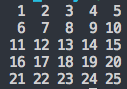
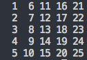
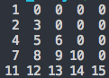
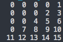
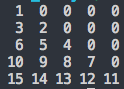
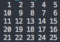
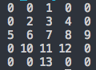
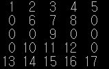
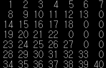

## 정보처리기사 실기 알고리즘 정리 07

### 5행 5열의 배열에 다음과 같이 기억되는 순서도를 작성하시오. (행 고정 열 변화)

#### 알고리즘의 이해
* 배열에 숫자를 채우는 알고리즘은 숫자가 증가하면서 어떤 순서로 배열의 빈칸을 채우는지 규칙을 찾으면 됨.
* 행이 1이 고정되고 열이 1~5 변함, 행 고정 열 변화
  * 행이 1증가하는 동안 열은 1에서 5까지 증가시키면 됨.
* 행을 나타내는 변수 i, 열을 나타내는 변수  j
* 행이 1~5까지 변하는 동안 열은 매번 1에서~5까지 변하는 규칙
  * 바깥쪽 반복 변수 i, 안쪽 반복 변수 j

~~~cpp
main() {

  int i, j, num;
  int a[5][5];

  num = 0;
  for (i = 0; i < 5; i++) {            // i는 행을 나타냄
    for (j = 0; j < 5; j++) {          // j는 열을 나타냄
      num++;
      a[i][j] = num;                   // 행 고정 열 변화
    }
  }

  for (int x = 0; x < 5; x++)
  {
    for (int y = 0; y < 5; y++)
    {
      printf("%3d", a[x][y]);
    }
    printf("\n");
  }
}
~~~

### 5행 5열의 배열에 다음과 같이 기억시키는 순서도를 작성하시오. (열 고정 행 변화)

#### 알고리즘의 이해
* 행을 나타내는 변수 j, 열을 나타내는 변수 i
* 이 문제는 열(i) 1에서 5까지 변하는 동안 행(j)은 매번 1에서 5까지 변한다는 규칙이 있음.
  * 바깥쪽 반복문 반복 변수를 i, 안쪽 반복문의 반복 변수를 j로

~~~cpp
main() {
  int i, j, num;
  int a[5][5];

  num = 0;
  for(i = 0; i < 5; i++) {     // i는 열을 나타냄
    for(j = 0; j < 5; j++) {   // j는 행을 나타냄
      num++;        
      a[j][i] = num;                // 열 고정, 행 변화
    }
  }
  for (int x = 0; x < 5; x++)
  {
    for (int y = 0; y < 5; y++)
    {
      printf("%3d", a[x][y]);
    }
    printf("\n");
  }
}
~~~

### 5행 5열의 배열에 다음과 같이 기억시키는 순서도를 작성하시오. (왼쪽 직각 삼각형 만들기)

#### 알고리즘의 이해
* 2차원 배열을 채우는 문제는 수치가 증가하면서 어떤 순서로 행과 열을 채우는지 규칙을 찾는 것이 중요.
  * 행을 나타내는 변수와 열을 나타내는 변수를 반복문의 반복 변수로 사용할 수 있도록 규칙을 찾음.
* 행을 나타내는 변수를 i, 열을 나타내는 변수를 j라고 하면 이 문제는 행(i)이 1에서 5까지 변하는 동안 열(j)은 매번 1에서 행번호(i)까지만 증가한다는 규칙이 있음. 
  * 그러므로 바깥쪽 반복문의 반복 변수를 i로 하여 1에서 5까지 변하게 하고, 안쪽 반복문의 반복 변수를 j로 하여 1에서 i까지 변하게 한 후 a배열의 i행 j열(a[i][j])에 1~15까지 증가하는 값을 차례로 채워 나가면 됨.

~~~cpp
main() {
  int i, j, num;
  int a[5][5] = { 0 };             // 배열 a의 모든 요소를 0으로 초기화

  num = 0;
  for (i = 0; i <= 4; i++) {       // i는 행
    for (j = 0; j <= i;j++) {      // j는 열, 행번호까지 숫자를 찍음.
      num++;
      a[i][j] = num;
    }
  }
  for (int x = 0; x < 5; x++)
  {
    for (int y = 0; y < 5; y++)
    {
      printf("%3d", a[x][y]);
    }
    printf("\n");
  }
}
~~~

### 5행 5열의 배열에 다음과 같이 기억시키는 순서도를 작성하시오. (오른쪽 직각 삼각형 만들기)

#### 알고리즘의 이해
* 행을 나타내는 변수 i, 열을 나타내는 변수 j
* 행이 1일 때 열은 5~5, 행이 2일 때 열은 4~5, 3일 때 3~5, 4일 때 2~5, 5일 때 1~5로 변함
  * 행이 1~5까지 변하는 동안 열은 매번 6-i에서 5까지 변한다는 규칙이 있음. 
  * 그러므로 바깥쪽 반복문의 반복변수를 i로 하여 1에서 5까지 변하게 함
  * 안쪽 반복문의 반복 변수를 j로 하여 6-i에서 5까지 변하게 한 후 a배열의 a[i][j]에 값을 차례로 채워 나가면 됨

~~~cpp
main() {
  int i, j, num;
  int a[5][5] = { 0 };

  num = 0;
  for (i = 0; i <= 4; i++) {
    for(j = 4 - i; j <= 4; j++) {
      num++;
      a[i][j] = num;
    }
  }
  for (int x = 0; x < 5; x++)
  {
    for (int y = 0; y < 5; y++)
    {
      printf("%3d", a[x][y]);
    }
    printf("\n");
  }
}
~~~

### 5행 5열의 배열에 다음과 같이 기억시키는 순서도를 작성하시오. (왼쪽 직각 삼각형 오른쪽부터 채우기)

#### 알고리즘의 이해 
* 행을 나타내는 변수 i, 열을 나타내는 변수 j
* 행이 1에서 5까지 변하는 동안 j는 행번호와 같은 숫자에서 시작하여 1까지 -1씩 증가한다는 규칙
* 그러므로 바깥쪽 반복문의 반복 변수를 i로 하여 1에서 5까지 변하게 함
* 안쪽 반복문의 반복 변수 j로 하여 i에서 1까지 -1씩 증가하여 변하게 함. 마지막에 A[i][j]에 1~15까지 증가하는 값을 차례로 채워 나감

~~~cpp
main() {
  int i, j, num;
  int a[5][5] = { 0 };

  num = 0;
  for (i = 0; i <= 4; i++) {          // i는 행을 나타냄
    for(j = i; j >= 0; j--) {          // j는 열을 나타냄 행 번호에서 시작, -1증가 
      num++;
      a[i][j] = num;
    }
  }
  for (int x = 0; x < 5; x++)
  {
    for (int y = 0; y < 5; y++)
    {
      printf("%3d", a[x][y]);
    }
    printf("\n");
  }
}
~~~

### 5행 5열의 배열에 다음과 같이 기억시키는 순서도를 작성하시오. (‘ㄹ’자로 채우기)

#### 알고리즘의 이해
* 행을 나타내는 변수 i, 열을 나타내는 변수 j
* 행이 1에서 5까지 변하는 동안 열은 1에서 5까지 1씩 증가하는 작업과 5에서 1까지 -1씩 증가하는 작업을 번갈아 가며 수행한다는 규칙
* 그러므로 바깥쪽 반복문의 반복 변수를 i로 하여 1에서 5까지 변하게 함
* 안쪽 반복문 반복 변수를 j로 하여 1에서 5까지 또는 5에서 1까지 반복할 수 있도록 열의 시작 위치와 끝 위치를 변수로 지정해 주어야 함.
  * 열의 시작 위치가 first이고 끝 위치가 last라면, 행 번호 i가 1일 때는 first = 1, last = 5로 시작하여 j를 1에서 5까지 1씩 증가시키고, i가 2일 때는 first = 5, last = 1로 변경하여 j를 5에서 1까지 -1씩 증가시키면서 반복.
  * i가 3일 때는 다시 first = 1, last = 5로 변경하여 반복하면서 a배열의 i행 j열(a[i][j])에 1~25까지 증가하는 값을 차례로 채워 나가면

~~~cpp
main() {
  int num, first, last, sw, i, j, tmp;
  int a[5][5];

  num = 0;      
  first = 0;      // 시작 열을 나타내는 인덱스
  last = 4;       // 끝 열을 나타내는 인덱스
  sw = 1;         // sw는 증가값(1, -1) 행에 따라 반복해서 바뀜

  for(i = 0; i <= 4; i++) {
    for(j = first; j != last + sw; j += sw) { // start, last 지칭 열이 행마다 바뀜
      num++;
      a[i][j] = num;
    }
    
    tmp = first;      // 행이 바뀔 때마다 start랑 last 값 변경
    fisrt = last;
    last = tmp;

    sw *= -1; // 증가 값을 변경
  }

  for (int x = 0; x < 5; x++)
  {
    for (int y = 0; y < 5; y++)
    {
      printf("%3d", a[x][y]);
    }
    printf("\n");
  }
}
~~~

### 5행 5열의 배열에 다음과 같이 기억시키는 순서도를 작성하시오. (다이아몬드 만들기)

 (잘 봐.. 다이아모양이야..)

#### 알고리즘의 이해
* 행 나타내는 변수 i, 열 나타내는 변수 j
  * 1행에서의 열의 시작과 끝은 3
  * 3행까지(i가 3일 때까지)는 행이 증가할 때마다 열의 시작은 -1씩 증가하고, 열의 끝은 1씩 증가.
  * 3행을 지나면 행이 증가할 때마다 열의 시작은 1씩 증가, 열의 끝은 -1씩 증가.
* 규칙이 위와 같음. 바깥쪽 반복문의 반복 변수 i, 1~5까지 변하게 함, 안쪽 반복문 반복 변수 j, 임의의 숫자로 시작하고 끝낼 수 있도록 열의 시작 위치와 끝 위치를 변수로 지정.
  * 열의 시작 위치 start, 열의 끝위치 end 라면, 처음 i가 1일 때는 start = 3, end = 3으로 시작
  * i가 3이 될 때까지 start는 -1씩 증가, end는 1씩 증가.
  * i가 3을 넘어서면 start는 1씩 증가, end는 -1씩 증가.
  * 위 규칙을 진행하며 a[i][j]에 1~13까지 증가하는 값을 차례로 채워 나감.

~~~cpp
main() {
  int i, j;
  int a[5][5] = { 0 };
  int num = 0;
  int start = 2, end = 2; 
  // c언어는 0부터 시작하므로 3번째 자리를 뜻함.
  // start - 열의 시작, end - 열의 끝을 나타내는 인덱스.

  for (i = 0; i <= 4; i++) {

    for (j = start; j <= end; j++) {  // start부터 end까지 숫자를 증가시키고 값을 넣는다.
      num++;
      a[i][j] = num;
    }

    if (i >= 2) {       // 만약 i(행)이 3을 넘어가면 
      start++;          // 다시 start를 늘리고 end를 줄임
      end--;
    } else {            // 0~2번째 행까진 
      start--;          // start를 줄이고 end를 늘림
      end++;
    }

  }

  for (int x = 0; x < 5; x++)
  {
    for (int y = 0; y < 5; y++)
    {
      printf("%3d", a[x][y]);
    }
    printf("\n");
  }
}
~~~

### 배열의 크기를 입력 받아 배열의 크기에 따라 아래와 같이 기억시키는 순서도를 작성하시오. 단, 배열의 크기는 홀수로만 입력이 가능하고, 여기에서는 5를 입력 받았다고 가정한다. (모래시계 만들기)

#### 알고리즘의 이해
* 5행 5열의 배열을 a라고 하고 행을 나타내는 변수를 i, 열을 나타내는 변수를 j라고 하면, 이 문제는 행이 1에서 5까지 변하는 동안 열의 다음의 규칙으로 변함.
  * 1행에서 열의 시작은 1, 끝은 5
  * 3행까지(i가 3일때까지)는 행이 증가할 때마다 열의 시작은 행번호(i)와 같고, 열의 끝은 -1씩 증가
  * 3행을 지나면 행이 증가할 때마다 열의 시작이 -1씩 증가하고 열의 끝은 행번호(i)와 같다
* 여기서는 두 개의 다른 반복문을 이용하여 문제를 해결하고자 함. 하나는 바깥쪽 반복문의 반복 변수 i로 하여 1에서 3까지 변하게 하고, 안쪽 반복문의 반복 변수 j는 행 번호로 시작하고, 끝은 임의의 숫자로 끝낼 수 있도록 변수를 지정함.
* 행이 증가할 때마다 열의 끝을 -1씩 증가시키며 a 배열의 i행 j열(a[i][j])에 1에서 9까지 증가하는 값을 채운다. 이어서 또 하나의 중첩 반복문을 이용하여 나머지 숫자를 채운다. 바깥쪽 반복문의 반복 변수를 i로 하여 4에서 5까지 변하게 하고, 안쪽 반복문의 반복 변수 j는 임의의 숫자로 시작할 수 있도록 변수로 시작하고, 끝은 행번호와 같으므로 i를 사용한다. 행이 증가할 때마다 열의 시작은 -1씩 증가시키며 a배열의 i행 j열(a[i][j])에 10에서 17까지 증가하는 값을 차례로 채운다.
* 변수
  * x : 입력 받은 배열의 크기가 저장될 변수, 즉, x가 5면 배열의 크기는 5행 5열이 된다.
  * a[x][x] : 숫자가 저장될 x행 x열의 2차원 배열
  * m : 배열의 중간 행 번호가 저장될 변수, 즉 5행 5열의 배열인 경우 m은 3이다.
  * startOrEnd : 행에서 열의 시작 위치 또는 끝 위치를 지정해 주는 변수
  * i : 배열의 행 위치를 지정해 주는 변수
  * j : 배열의 열 위치를 지정해 주는 변수
  * num : 1씩 증가되는 숫자가 저장될 변수, 즉 num은 1~17까지 차례로 변경됨

~~~cpp
main() {
        int m, startOrEnd, i, j, num;
        int a[5][5];
        // 초기화, 원래 입력받은 값으로 배열을 만들어야 하는데 에러나서 5로 하드코딩

        for (i = 0; i < 5; i++)
               for (j = 0; j < 5; j++)
                       a[i][j] = 0;
        num = 0;                      // 1씩 증가되는 숫자가 저장될 변수
        startOrEnd = 5;               // 얘는 행에서 열의 시작 위치 또는 끝 위치를 지정해 주는 변수.
        m = 5 / 2;                    // 행의 중간 2

        for (i = 0; i <= m; i++) {                   // 중간 행까지
               startOrEnd--;                                                       
               for (j = i; j <= startOrEnd; j++) {   // 열의시작(행(i)0,1,2)부터 열의 끝(4,3,2)까지
                       num++;
                       a[i][j] = num;                // 해당 배열에 값을 채움
               }
        }

        for (i = m + 1; i <= 5 - 1; i++) {           // 중간행+1부터 마지막 행까지
               startOrEnd--;                                                       
               for (j = startOrEnd; j <= i; j++) {   // 열의 시작(1,0) 부터 열의 끝(행(i),3,4)까지
                       num++;
                       a[i][j] = num;
               }
        }

        for (int y = 0; y < 5; y++) {
               for (int z = 0; z < 5; z++)
                       printf("%3d", a[y][z]);
               printf("\n");
        }
}
~~~

### 배열의 크기를 입력 받아 배열의 크기에 따라 아래와 같이 기억시키는 순서도를 작성하시오. 단, 배열의 크기는 홀수로만 입력이 가능하고 여기서는 배열의 크기로 7을 입력 받았다고 가정한다. (오른쪽에 빈 삼각형 만들기)

#### 알고리즘의 이해
* 7행 7열의 배열을 a라고 하고, 행을 나타내는 변수를 i, 열을 나타내는 변수를 j라고 하면, 행(i)이 1에서 7까지 변하는 동안 열(j)는 다음의 규칙으로 변함
  * 1에서 3행까지(i가 3일 떄까지)는 열의 시작 위치가 1이고, 끝 위치는 8-i이다.
  * 4행부터는 열의 시작 위치가 1이고, 열의 끝 위치는 i와 같다.
* 바깥쪽 반복문의 반복 변수를 i로 하여 1에서 7까지 변하게 하고, 안쪽 반복문의 반복 변수 j는 1에서 시작해서 임의의 숫자로 끝낼 수 있도록 열의 끝 위치를 변수(L)로 지정해야 함. 1행에서 3행까지는 열이 1에서 8-i가 될 때까지, 4행부터는 열이 1에서 그 때의 행 번호와 같은 i가 될 떄까지 1씩 증가시키며 A배열의 i행 J열(a[i][j])에 1~40까지 증가하는 값을 차례로 채워 나가면 됨.
* 변수
  * x : 입력받은 배열의 크기가 저장될 변수
  * a[x][x] : 숫자가 저장될 x행 x열의 2차원 배열
  * m : 배열의 중간 행 번호가 저장될 변수
  * num : 1씩 증가되는 숫자가 저장될 변수
  * i : 배열의 행 위치가 저장될 변수
  * j : 배열의 열 위치가 저장될 변수
  * end : 행에서 숫자를 입력할 열의 끝 위치를 지정해 주는 변수

~~~cpp
main() {
        int m, num, i, j, end;
        // scanf("%d", &x);
        // int a[x][x]; 안된다고 ㅠㅠ
        int a[7][7];
        for (i = 0; i <= 7-1; i++) {  // 0으로 초기화
               for (j = 0; j < 7; j++)
                       a[i][j] = 0;
        }
        num = 0;               // 1씩 증가될, 채울 값
        m = 7 / 2;             // 가운데 행
        for (i = 0; i < 7; i++) {     
               if (i < m)                            // 행이 가운데 행 이전까진
                       end = 7 - i;           // 행의 끝이 7 - i
               else
                       end = i + 1;           // 가운데 지나면 행(i) 자체가 열의 끝
               for (j = 0; j < end; j++) {
                       num++;
                       a[i][j] = num;
               }
        }
        for (i = 0; i < 7; i++) {
               for (j = 0; j < 7; j++)
                       printf("%3d", a[i][j]);
               printf("%\n");
        }
}
~~~

### 배열의 열 크기를 입력 받아 배열의 크기에 따라 아래와 같이 기억시키는 순서도를 작성하시오. 단, 여기서는 배열의 크기로 4를 입력 받았다고 가정한다. (이등변 삼각형 만들기)

#### 알고리즘의 이해
* 7행 4열의 배열을 a라고 하고, 행을 나타내는 변수를 i, 열을 나타내는 변수를 j라고 하면, 열(j)이 1에서 4까지 변하는 동안 행(i)은 다음의 규칙으로 변함
  * 첫 열에서 행의 시작과 끝은 4이다
  * 다음 열부터는 열이 증가할 때마다 행의 시작이 -1씩 증가하고, 행의 끝은 1씩 증가한다. 
* 열 번호를 사용할 바깥쪽 반복문의 반복 변수를 j로 하여 1에서 4까지 변하게 하고, 행 번호로 사용할 안쪽 반복문의 반복 변수 i는 임의의 숫자로 시작하고 끝낼 수 있도록 행의 시작 위치와 끝 위치를 변수로 지정한다.
* 행의 시작 위치가 start이고 끝 위치가 end일 때, start는 5-j, end는 j+3으로 시작하면 열(j)이 증가할 때마다 start는 -1씩 증가되고, end는 1씩 증가된다. 이 때 a배열의 i행 j열(a[i][j])에 1~16까지 증가하는 값을 차례로 채워 나가면 됨.
* 변수
  * col : 입력 받은 배열의 열 크기가 저장될 변수
  * row : 배열의 행 크기를 저장할 변수
  * a[row][col] : 숫자가 저장될 row행 col 열의 2차원 배열
  * i : 배열의 행 위치를 지정해 주는 변수
  * j : 배열의 열 위치를 지정해 주는 변수
  * start : 행의 시작 위치가 저장될 변수
  * end : 행의 끝위치가 저장될 변수
  * num : 1씩 증가되는 숫자가 저장될 변수

~~~cpp
main() {
        int num, start, end, i, j;
        // scanf("%d", &col);
        // row = col * 2 - 1;
        // int a[row][col]; row 7, col 4
        int a[7][4];
        for (i = 0; i < 7; i++)
               for (j = 0; j < 4; j++)
                       a[i][j] = 0;
        num = 0;
        for (j = 0; j <= 4 - 1; j++) {        // 바깥쪽 반복 변수 j는 열!
               start = 4 - (j + 1);          // 행의 시작
               end = (j - 1) + 4;                    // 행의 끝
               for (i = start; i <= end; i++) {      // 안쪽 반복 변수는 i, 행!
                       num++;
                       a[i][j] = num;
               }
        }
        for (i = 0; i < 7; i++) {
               for (j = 0; j < 4; j++) {
                       printf("%3d", a[i][j]);
               }
               printf("\n");
        }
}
~~~

