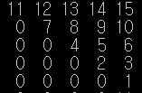
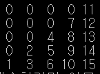
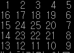
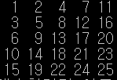
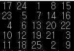
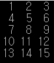
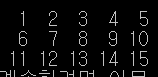

## 정보처리기사 실기 알고리즘 정리 08

### 배열에 A와 같이 입력한 후 90도 회전한 결과를 배열 B에 이동하는 순서도를 작성하시오. (90도 회전하기)

  

#### 알고리즘의 이해
* 5행 5열의 배열을 a라고 하고, 행을 나타내는 변수를 i, 열을 나타내는 변수를 j라고 하면, 행(i)이 5에서 1까지 -1씩 증가하며 변하는 동안 열(j)은 매번 행 번호(i)로 시작하여 5로 끝나는 규칙이 있음. 
* 그러므로 바깥쪽 반복문의 반복 변수를 i로 하여 5에서 1까지 변하게 하고, 안쪽 반복문의 반복 변수를 j로 하여 i에서 5까지 변하게 한 후 a배열의 i행 j열(a[i][j])에 1~15까지 증가하는 값을 차례롤 채워 나가면 됨.
* a배열을 1행부터 5행까지 차례대로 b 배열로 옮길 때, a배열의 요소가 b배열의 어느 위치로 옮겨갈지 위치를 계산.
  * a배열의 1행이 b배열의 5열로 이동하고
  * a배열의 2행이 b배열의 4열로 이동하고
  * a배열의 3행이 b배열의 3열로 이동하고
  * a배열의 4행이 b배열의 2열로 이동하고
  * a배열의 5행이 b배열의 1열로 이동함
* a 배열의 행을 b 배열의 열로 옮기므로 a 배열의 행을 고정시키고 열을 변화시킬 때, b 배열은 열을 고정시킨 채 행을 변화시키면서 a배열의 요소를 b배열로 치환하면 됨
* a배열의 행으로 사용할 바깥쪽 반복문의 반복 변수 i가 1,2,3,4,5로 변할 때 b배열의 열은 5,4,3,2,1로 변함. 즉 b배열의 열은 6-i이다.
* a배열의 열로 사용할 안쪽 반복문의 반복 변수 j가 1,2,3,4,5로 변할 때 b배열의 행(j)도 1,2,3,4,5로 변하므로 b배열의 행은 a배열의 열과 같다.
* 바깥쪽 반복문의 반복 변수 i로 하여 1에서 5까지 변하게 하고, 안쪽 반복문의 반복 변수 j로 하여 1에서 5까지 변하게 할 때 위의 규칙을 적용하면 b[j][6-i] = a[i][j]가 됨.
* 변수
  * a[5][5] : 숫자가 저장될 5행 5열의 2차원 배열
  * b[5][5] : a 배열의 데이터를 90도 회전하여 저장할 2차원 배열
  * i : 배열의 행, 열을 지정해 주는 변수
  * j : 배열의 행, 열을 지정해 주는 변수
  * num : 1씩 증가되는 숫자가 저장될 변수.

~~~cpp
main() {
        int i, j, num;
        int a[5][5] = { 0 }, b[5][5] = { 0 };
        num = 0;
        // a배열을 먼저 만듦
        for (i = 4; i >= 0; i--) {            // 처음 a그림 상태를 만듦 4~0행 역순
               for (j = i; j <= 4; j++) {    // 열의시작 행(i), 열의 끝 4
                       num++;
                       a[i][j] = num;
               }
        }
        
        // b배열의 규칙을 파악해서 맵핑
        for (i = 0; i <= 4; i++) {
               for (j = 0; j <= 4; j++)      //행과 열이 어떻게 바뀌는지
                       b[j][4 - i] = a[i][j]; // 이 규칙을 찾으면 끝.
        }          

        // 출력
        for (i = 0; i <= 4; i++) {
               for (j = 0; j <= 4; j++)
                       printf("%3d", a[i][j]);
               printf("\n");
        }

        printf("\n");
        for (i = 0; i <= 4; i++) {
               for (j = 0; j <= 4; j++)
                       printf("%3d", b[i][j]);
               printf("\n");
        }
}
~~~

### 5행 5열의 배열에 다음과 같이 기억시키는 순서도를 작성하시오. (달팽이 만들기)

#### 알고리즘의 이해
* -1을 이용한 증가와 감소
  * 1에 -1을 곱하면 -1이 되므로 -1씩 증가시킬 수 있고, -1에 -1을 곱하면 1이 되므로 1씩 증가시킬 수 있음.
* 행 고정, 열 증가 => 열 고정, 행 증가 => 행 고정, 열 감소 => 열 고정, 행 감소 x 2, 행고정, 열증가
  * 9회전
* 두 회전을 수행할 때마다 수행 횟수가 1씩 줄어든다.
  * 처음 1회전은 5회를 수행
  * 2, 3 회전은 수행 횟수가 1 줄어 4회를 수행
  * 4, 5 회전은 수행 횟수가 1 줄어 3회를 수행
  * 6, 7 회전은 수행 횟수가 1 줄어 2회를 수행
  * 8, 9 회전은 수행 횟수가 1 줄어 1회를 수행
* 두 회전을 수행할 때마다 행과 열에서 증가와 감소가 반복된다.
  * 1회전 : 행 고정, 열 증가, 2회전 : 열 고정, 행 증가 -> 증가
  * 3회전 : 행 고정, 열 감소, 4회전 : 열 고정, 행 감소 -> 감소
  * 5회전 : 행 고정, 열 증가, 6회전 : 열 고정, 행 증가 -> 증가
  * 7회전 : 행 고정, 열 감소, 8회전 : 열 고정, 행 감소 - > 감소
  * 9회전 : 행 고정, 열 증가 -> 증가
* 앞의 규칙을 적용하려면 서로 다른 2개의 반복문이 필요. 하나는 행을 고정하고 열을 증가 또는 감소할 반복문, 다른 하나는 열을 고정하고 행을 증가 또는 감소할 반복문
* 변수
  * a[5][5] : 5행 5열의 2차원 배열
  * num : 1씩 증가되는 숫자를 저장할 변수
  * i : 배열의 행 위치를 지정해 주는 변수
  * n : 반복문의 반복 변수
  * j : 배열의 열 위치를 지정해 주는 변수
  * c: 행과 열의 증가 혹은 감소 여부가 지정될 변수, 
    * c = -1이면 행이나 열을 감소하고
    * 1이면 행이나 열을 증가
  * f : 각 회전에서 수행할 수행 횟수가 지정될 변수, 즉 f는 5,4,3,2,1로 변경됨.

~~~cpp
main() {
        int num, c, i, j, f, n;
        int a[5][5] = { 0 };
        num = 0;
        c = 1;  // 증가, 감소를 결정짓는 변수 (1 = 증가, -1 = 감소)
        i = 0;  // 행위치
        j = -1; // 열위치
        f = 5;  // 각 회전에서 수행할 수행 횟수
        while (1) {
               for (n = 1; n <= f; n++) {    // 행 고정, 열 변화
                       num++;
                       j += c;
                       a[i][j] = num;
               }
               
               f--;        // 반복 횟수 줄이고
               
               if (f <= 0) // 회전 수행 횟수가 5~1이 될때까지 반복, 0되면 빠져나옴
                       break;
               for (n = 1; n <= f; n++) {    // 열 고정, 행 변화
                       num++;
                       i += c; 
                       a[i][j] = num;
               }
               c *= -1;       // 증가-> 감소, 감소 -> 증가
        }
        for (i = 0; i <= 4; i++) {
               for (j = 0; j <= 4; j++) {
                       printf("%3d", a[i][j]);
               }
               printf("\n");
        }
}
~~~

### 5행 5열의 배열에 다음과 같이 기억시키는 순서도를 작성하시오. (대각선으로 채우기)

#### 알고리즘의 이해
* 1회전 (1,1)
* 2회전 (1,2) (2,1)
* 3회전 (1,3) (2,2) (3,1)
* 4회전 (1,4) (2,3) (3,2) (4,1)
* 5회전 (1,5) (2,4) (3,3) (4,2) (5,1)
* 6회전 (2,5) (3,4) (4,3) (5,2)
* 7회전 (3,5) (4,4) (5,3)
* 8회전 (4,5) (5,4)
* 9회전 (5,5)
* 5행 5열의 배열을 a라고 하고 행을 나타내는 변수를 i, 열을 나타내는 변수를 j라고 하면 다음과 같은 규칙이 있음
* 기본적으로 대각선 방향으로, 즉 행은 증가하고 열은 감소하면서 숫자를 저장할 배열의 위치가 변경됨
* 같은 회전에서의 각 배열의 위치는 행과 열을 더한 값이 모두 같다. 
  * 즉, 2회전은 (1,2)와 (2,1)로 행과 열을 더한 값은 모두 3이다. 
* 회전이 증가할 때마다 행과 열을 더한 값이 1씩 증가
* 행과 열을 더한 값을 이용하여 각 회전을 수행함.
  * 즉, 1회전은 2를 이용하고, 2회전은 3, ... 마지막(9) 회전은 10을 이용.
* 바깥쪽 반복문은 1회전의 행+열 값인 2에서 시작하여 마지막 회전의 행+열 값인 10까지 반복하고, 이 값을 이용하여 열 위치(k)를 만든다.
* 안쪽 반복문은 1에서 시작하여 5까지 반복하고, 이 값을 행 위치(j)로 이용한다.
* 바깥쪽 반복문의 반복 변수 i에서 안쪽 반복문의 반복 변수 j를 빼면 열 위치 k가 됨.

* 변수
  * a[5][5] : 숫자가 저장될 5행 5열의 2차원 배열
  * num : 1씩 증가되는 숫자가 저장될 변수
  * i : 바깥쪽 반복문의 반복 변수로, 회전수가 됨
  * j : 안쪽 반복문의 반복 변수로, 배열의 행 위치를 지정
  * k : 배열의 열 위치를 지정해 주는 변수

~~~cpp
main() {
        int i, j, k;
        int a[5][5] = { 0 };
        int num = 0;
        for (i = 0; i <= 8; i++) {            // 바깥쪽 반복문은 회전 수를 지정함.
               for (j = 0; j <= 4; j++) {     // 안쪽 반복문은 행을 지정, j는 행 위치
                       // 회전 수와 안쪽 반복문의 반복 변수를 이용하여 배열의 열 위치를 지정.
                       k = i - j;             // 배열의 열 위치 k 계산.
                       if (k < 0) continue;   // 열의 위치는 0~4까지 변함.
                       if (k > 4) continue;
                       num++;
                       a[j][k] = num;
               }
        }
        for (i = 0; i <= 4; i++) {
               for (j = 0; j <= 4; j++)
                       printf("%3d", a[i][j]);
               printf("\n");
        }
}
~~~

### 5행 5열의 배열 a에 다음과 같이 가로와 세로의 합이 모두 같은, 일명 마방진을 완성하는 순서도를 작성하시오. (마방진(Magic Square))

#### 알고리즘의 이해
* 마방진은 가로의 합, 세로의 합, 대각선의 합이 모두 같은 배열을 의미하는 것으로, 5행 5열의 배열 a에 마방진을 만드는 규칙은 다음과 같음.
* 시작은 [1][3]이다.
  * 마방진은 항상 1행의 가운데 열에서 시작.
* 기본적으로 왼쪽에서 오른쪽 위 대각선 방향으로, 즉 행은 감소, 열은 증가 시키면서 숫자를 채운다.
* 행 감소, 열 증가를 수행하면서 위치를 결정하다가 행이 1보다 작으면 행은 5가 됨.
* 행 감소, 열 증가를 수행하면서 위치를 결정하다가 열이 5보다 크면 열은 1이 된다.
* 채우는 숫자가 5의 배수의 다음 숫자일 경우, 채울 위치는 이전 위치에서 행만 1증가시킨다.
* 변수
  * a[5][5] : 숫자가 저장될 5행 5열의 2차원 배열
  * i : 배열의 행 위치를 지정해 주는 변수
  * j : 배열의 열 위치를 지정해 주는 변수
  * k : 1에서 25까지 1씩 증가되는 숫자가 저장될 변수
  * nmg : k가 5의 배수인지 확인하기 위해 계산 후 나머지가 저장될 변수

~~~cpp
main() {
        int i, j, k, nmg;
        int a[5][5] = { 0 };
        i = 0;
        j = 5 / 2;
        for (k = 1; k <= 25; k++) {
               a[i][j] = k;               // (1,3)에서 시작
               nmg = k - k / 5 * 5;
               if (nmg == 0) {            // 5의 배수면 행만 증가
                       i++;
                       continue;
               }
               i--;                       // 행감소
               j++;                       // 열증가
               if (i < 0)                 // 행이 0보다 작아지면 4로
                       i = 4;
               if (j > 4)                 // 열이 5보다 커지면 0으로
                       j = 0;
        }
        for (i = 0; i <= 4; i++) {
               for (j = 0; j <= 4; j++)
                       printf("%3d", a[i][j]);
               printf("\n");
        }
}
~~~

### 차원 배열의 크기를 입력 받아 그림과 같이 숫자를 채운 후 행과 열을 바꿔 출력하는 순서도를 작성하시오. 단, 여기에서는 행으로 5를, 열로 3을 입력 받았다고 가정한다. (행렬 변환)

 
 
 
5x3 => 3x5

#### 알고리즘의 이해
* 배열 a와 배열 b의 행과 열의 수가 다르기 때문에 먼저 어떤 배열을 기준으로 할 것인지를 정해야 함.
* 배열 a를 기준으로 하면 배열 a의 행과 열을 증가시키면서 5개의 숫자를 배열 b에 옮긴 후 배열 b의 행을 1 증가시키면 됨.
* 변수
  * row : 입력 받은 행이 저장될 변수
  * col : 입력 받은 열이 저장될 변수
  * a[row][col] : 입력 받은 행과 열을 기준으로 하여 숫자가 저장될 2차원 배열
  * b[col][row] : 배열 a의 행과 열을 바꾼 위치에 숫자가 저장될 2차원 배열
  * a_row : 배열 a의 행 위치를 지정해 주는 변수
  * a_col : 배열 a의 열 위치를 지정해 주는 변수
  * num : 1씩 증가되는 숫자가 저장될 변수
  * b_row : 배열 b의 행 위치를 지정해 주는 변수
  * b_col : 배열 b의 열 위치를 지정해 주는 변수

~~~cpp
main() {
        int a_row, a_col, b_row, b_col;
        int a[5][3];        // 5x3 배열 a 
        int b[3][5];        // 변환될 3x5 배열 b
        int num = 0;

        // a배열 만듦
        for (a_row = 0; a_row < 5; a_row++) {
               for (a_col = 0; a_col < 3; a_col++) {
                       num++;
                       a[a_row][a_col] = num;
               }
        }

        // a배열 출력
        for (int i = 0; i < 5; i++) {
               for (int j = 0; j < 3; j++)
                       printf("%3d", a[i][j]);
               printf("\n");
        }

        printf("\n\n");

        b_row = 0;
        b_col = -1;

        // b배열 만듦
        for (a_row = 0; a_row < 5; a_row++) {
               for (a_col = 0; a_col < 3; a_col++) {
                       b_col += 1;
                       b[b_row][b_col] = a[a_row][a_col];

                       if (b_col > 3) {     // b_col이 4가 되면(0부터 4열까지 입력)
                              b_row++;      // 배열 b의 행을 1증가
                              b_col = -1;   // b배열의 열을 초기화(0부터 입력되도록)
                       }
               }
        }

        // 출력
        for (int i = 0; i < 3; i++) {
               for (int j = 0; j < 5; j++)
                       printf("%3d", b[i][j]);
               printf("\n");
        }
}
~~~

