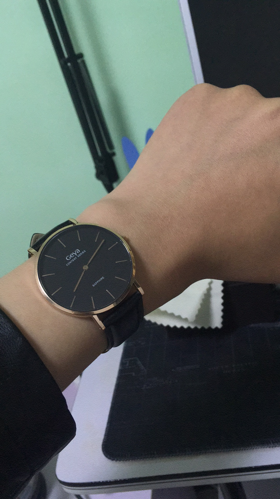
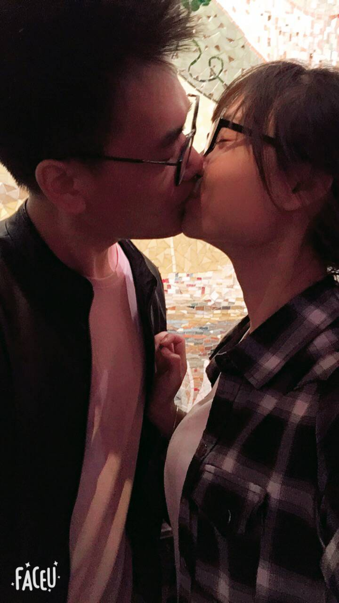
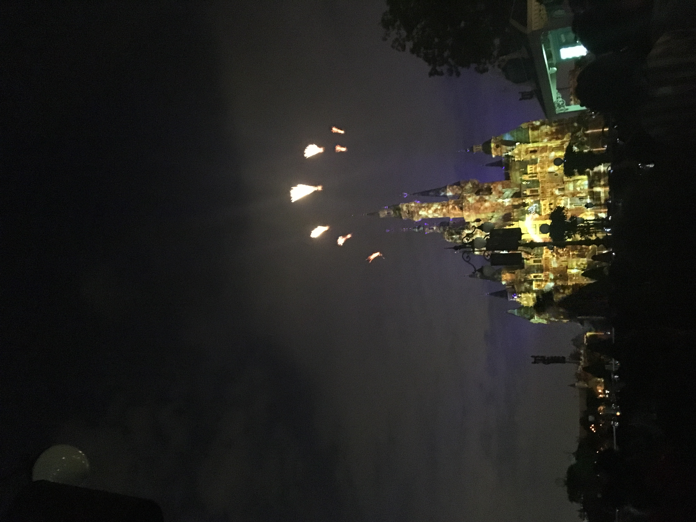
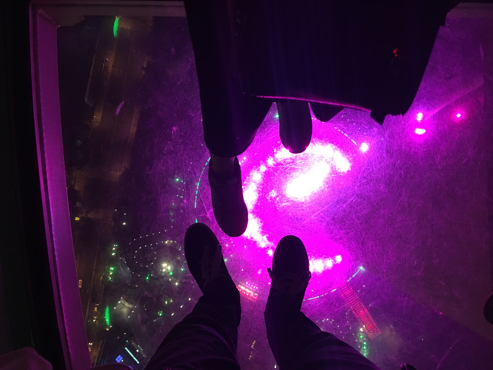
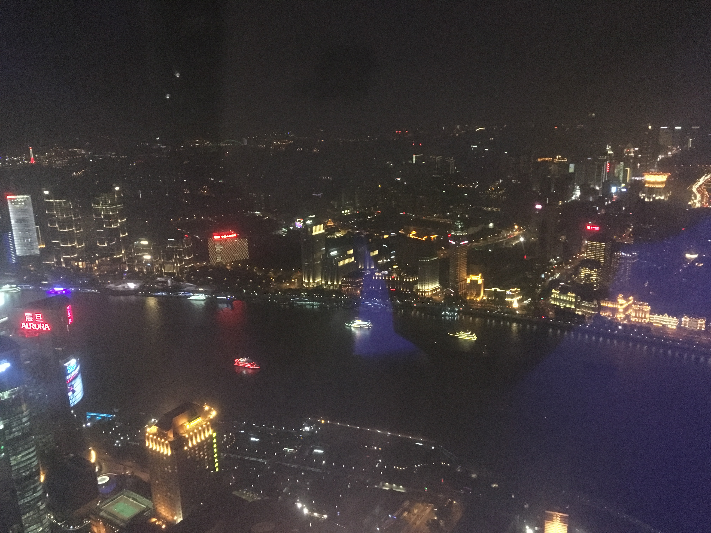
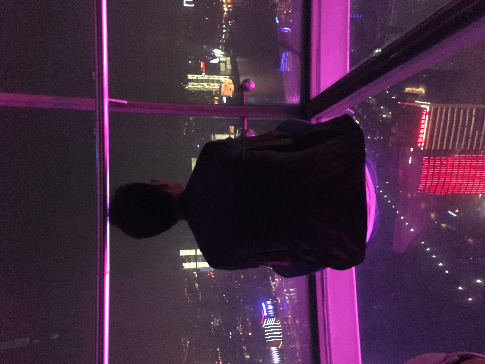
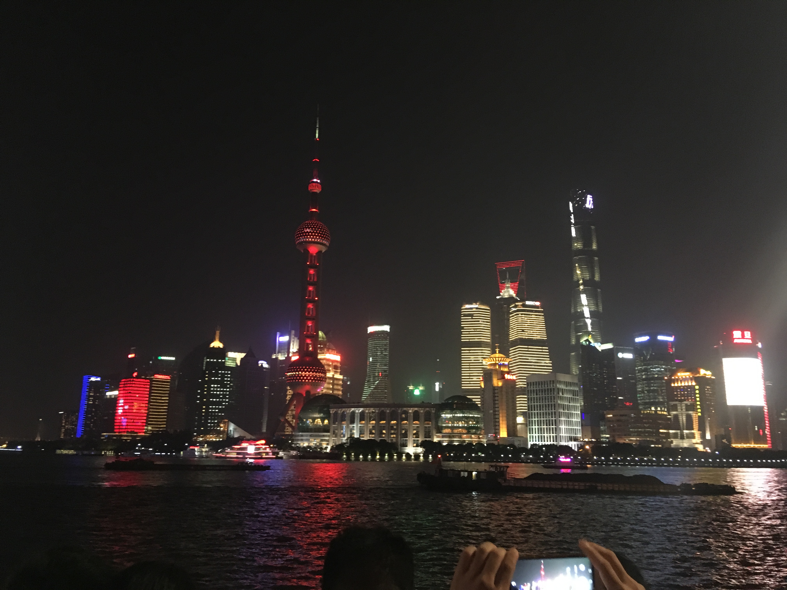
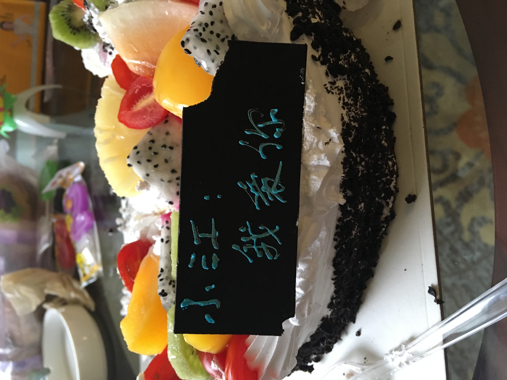

​	2018年与往年相比是个特别的一年，因为时隔五年，我曾经深爱的她来到了我身边。虽然目前她在西安读书，我在上海工作，但是面对这份难得的爱情，我们彼此都没有退缩。2019年已经过去了快一个月了，我们在一起也将近300个日日夜夜，而这些珍贵的回忆我不愿让他们发黄褪色。

------

​	2018年4月10日，我收到了你的礼物，是一块我很喜欢的手表，你说不久后会来上海看我。

------

​	4月19日，你坐了一晚上的火车来到了上海，我下午请了假去火车站接你，心情紧张又激动。21日，我们去了迪士尼乐园，虽然排队很辛苦，但是玩的还是挺开心的 :happy: 。

​

------

​	4月22日，我们去了东方明珠，我带你去了太空舱观赏大上海的夜景，希望你能感受到一丝丝的浪漫。之后我们又乘坐了你未曾坐过的轮渡，穿越黄浦江，去南京路溜达。

------

​	6月16日，我去西安找你，小雨，你来火车站接我，我们去了你的学校。这几天我们没有去什么地方游玩，主要是腻歪在一起吃这吃那。你订了蛋糕，还亲手给我做了寿司，隔天我们还去吃了李想大虾，当然还有我们的最爱--凉皮和肉夹馍。差点忘了，还去了大雁塔看音乐喷泉。

------

​	好久不见，甚是想念，因为没抢到车票，国庆节还是你来上海了。晚上我请你吃了鸡爪蟹肉煲，很不幸我吃坏肚子了，没能陪你出去玩很是遗憾。

​	最后，以下是我跟你打电话时抬头看到的一片云朵，很神奇，有木有!? :happy:

