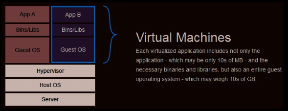
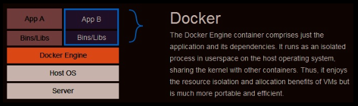

​	Docker使用Go语言进行开发实现，基于Linux内核的cgroup，namespace，以及AUFS类的UnionFS等技术，对进程进行封装隔离，属于操作系统层面的虚拟技术。由于隔离的进程独立于宿主和其他的隔离的进程，因此也称其为容器。

​	Docker在容器的基础上，进行了进一步的封装，从文件系统、网络互联到进程隔离等等，极大的简化了容器的创建和维护。使得Docker技术比虚拟机技术更为轻便、快捷。

​	下面的图片比较了Docker和传统虚拟化方式的不同之处。传统虚拟机技术是虚拟出一套硬件后，在其上运行一个完整操作系统，在该系统上再运行所需应用进程；而容器内的应用进程直接运行于宿主的内核，容器内没有自己的内核，而且也没有进行硬件虚拟。因此容器要比传统虚拟机更为轻便。

